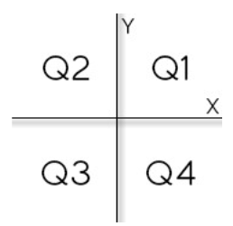
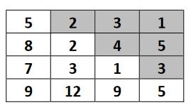

# Exercícios

1. #### Terreno

   Fazer um programa para ler as medidas da largura e comprimento de um terreno retangular com uma
   casa decimal, bem como o valor do metro quadrado do terreno com duas casas decimais. Em seguida,
   o programa deve mostrar o valor da área do terreno, bem como o valor do preço do terreno, ambos com
   duas casas decimais.

2. #### Retangulo

   Fazer um programa para ler as medidas da base e altura de um retângulo. Em seguida, mostrar o valor
   da área, perímetro e diagonal deste retângulo, com quatro casas decimais.

3. #### Idades

   Fazer um programa para ler o nome e idade de duas pessoas. Ao final mostrar uma mensagem com os
   nomes e a idade média entre essas pessoas, com uma casa decimal.

4. #### Soma

   Fazer um programa para ler dois valores inteiros X e Y, e depois mostrar na tela o valor da soma destes
   números.

5. #### Troco

   Fazer um programa para calcular o troco no processo de pagamento de um produto de uma mercearia.
   O programa deve ler o preço unitário do produto, a quantidade de unidades compradas deste produto,
   e o valor em dinheiro dado pelo cliente (suponha que haja dinheiro suficiente). Seu programa deve
   mostrar o valor do troco a ser devolvido ao cliente.

6. #### Circulo

   Fazer um programa para ler o valor "r" do raio de um círculo, e depois mostrar o valor da área do
   círculo com três casas decimais. A fórmula da área do círculo é a seguinte: 𝑎𝑟𝑒𝑎 = 𝜋. 𝑟^2. Você pode
   usar o valor de 𝜋 fornecido pela biblioteca da sua linguagem de programação, ou então, se preferir, use
   diretamente o valor 3.14159.

7. #### Pagamento

   Fazer um programa para ler o nome de um(a) funcionário(a), o valor que ele(a) recebe por hora, e a
   quantidade de horas trabalhadas por ele(a). Ao final, mostrar o valor do pagamento do funcionário com
   uma mensagem explicativa.

8. #### Consumo

   Fazer um programa para ler a distância total (em km) percorrida por um carro, bem como o total de
   combustível gasto por este carro ao percorrer tal distância. Seu programa deve mostrar o consumo
   médio do carro, com três casas decimais.

9. #### Medidas

   Fazer um programa para ler três medidas A, B e C. Em seguida, calcular e mostrar (imprimir os dados
   com quatro casas decimais):
   a) a área do quadrado que tem lado A
   b) a área do triângulo retângulo que base A e altura B
   c) a área do trapézio que tem bases A e B, e altura C

10. #### Duracao

    Fazer um programa para ler uma duração de tempo em segundos, daí imprimir na tela esta duração no
    formato horas:minutos:segundos.

11. #### Notas

    Fazer um programa para ler as duas notas que um aluno obteve no primeiro e segundo semestres de
    uma disciplina anual. Em seguida, mostrar a nota final que o aluno obteve (com uma casa decimal) no
    ano juntamente com um texto explicativo. Caso a nota final do aluno seja inferior a 60.00, mostrar a
    mensagem "REPROVADO".

12. #### Baskara

    Fazer um programa para ler os três coeficientes de uma equação do segundo grau. Usando a fórmula
    de Baskara, calcular e mostrar os valores das raízes x1 e x2 da equação com quatro casas decimais,
    Se a equação não possuir raízes reais, mostrar uma mensagem.

13. #### Menor_de_tres

    Fazer um programa para ler três números inteiros. Em seguida, mostrar qual o menor dentre os três
    números lidos. Em caso de empate, mostrar apenas uma vez.

14. #### Operadora

    Uma operadora de telefonia cobra R$ 50.00 por um plano básico que dá direito a 100 minutos de
    telefone. Cada minuto que exceder a franquia de 100 minutos custa R$ 2.00. Fazer um programa para
    ler a quantidade de minutos que uma pessoa consumiu, daí mostrar o valor a ser pago.

15. #### Troco_verificado

    Fazer um programa para calcular o troco no processo de pagamento de um produto de uma mercearia.
    O programa deve ler o preço unitário do produto, a quantidade de unidades compradas deste produto,
    e o valor em dinheiro dado pelo cliente. Seu programa deve mostrar o valor do troco a ser devolvido
    ao cliente. Se o dinheiro dado pelo cliente não for suficiente, mostrar uma mensagem informando o
    valor restante.

16. #### Glicose

    Fazer um programa para ler a quantidade de glicoseno sangue de uma pessoa e depois mostrar na tela a
    classificação desta glicose de acordo com a tabela de referência abaixo.

    | Classificação | Glicose                     |
    | ------------- | --------------------------- |
    | Normal        | Até 100 mg/dl               |
    | Elevado       | Maior que 100 até 140 mg/dl |
    | Diabetes      | Maior de 140 mg/dl          |

    

17. #### Dardo

    No arremesso de dardo, o atleta tem três chances para lançar o dardo à maior distância que conseguir.
    Você deve criar um programa para, dadas as medidas das três tentativas de lançamento, informar qual
    foi a maior.

18. #### Temperatura

    Deseja-se converter uma medida de temperatura da escala Celsius para Fahrenheit ou vice-versa. Para
    isso, você deve construir um programa que leia a letra "C" ou "F" indicando em qual escala vai ser
    informada uma temperatura. Em seguida o programa deve mostrar a temperatura na outra escala com
    duas casas decimais. A seguir é dada a fórmula para converter de Fahrenheit para Celsius (você deve
    deduzir a fórmula de Celsius para Fahrenheit): 
    $$
    C = 5/9 (F - 32)
    $$
    
19. #### Lanchonete 

    Uma lanchonete possui vários produtos. Cada produto possui um código e um preço. Você deve fazer um programa para ler o código e a quantidade comprada de um produto (suponha um código válido), e daí informar qual o valor a ser pago, com duas casas decimais, conforme tabela de produtos abaixo.

    | Código do produto | Preço do produto |
    | ----------------- | ---------------- |
    | 1                 | R$ 5.00          |
    | 2                 | R$ 3.50          |
    | 3                 | R$ 4.80          |
    | 4                 | R$ 8.90          |
    | 5                 | R$ 7.32          |
    
    
    
20. #### Multiplos

    Fazer um programa para ler dois números inteiros, e dizer se um número é múltiplo do outro. Os
    números podem ser digitados em qualquer ordem.

21. #### Aumento

    Uma empresa vai conceder um aumento percentual de salário aos seus funcionários dependendo de quanto
    cada pessoa ganha, conforme tabela abaixo. Fazer um programa para ler o salário de uma pessoa, daí mostrar
    qual o novo salário desta pessoa depois do aumento, quanto foi o aumento e qual foi a porcentagem de aumento.

    | Salário atual                      | Aumento |
    | ---------------------------------- | ------- |
    | Até R$ 1000.00                     | 20%     |
    | Acima de R$ 1000.00 até R$ 3000.00 | 15%     |
    | Acima de R$ 3000.00 até R$ 8000.00 | 10%     |
    | Acima de R$ 8000.00                | 5%      |

    

22. #### Tempo_de_jogo

    Leia a hora inicial e a hora final de um jogo. A seguir calcule a duração do jogo, sabendo que o mesmo
    pode começar em um dia e terminar em outro, tendo uma duração mínima de 1 hora e máxima de 24
    horas.

23. #### Coordenadas

    Leia os valores das coordenadas X e Y de um ponto no plano cartesiano. A seguir, determine qual o quadrante ao qual pertence o ponto (Q1, Q2, Q3 ou Q4). Se o ponto estiver na origem, escreva a mensagem “Origem”. Se o ponto estiver sobre um dos eixos escreva “Eixo X” ou “Eixo Y”, conforme for a situação.

    

24. #### Crescente

    Leia uma quantidade indeterminada de duplas de valores inteiros X e Y. Escreva para cada X e Y uma
    mensagem que indique se estes valores foram digitados em ordem crescente ou decrescente. O
    programa deve finalizar quando forem digitados dois valores iguais.

25. #### Media_idades

    Faça um programa para ler um número indeterminado de dados, contendo cada um, a idade de um
    indivíduo. O último dado, que não entrará nos cálculos, contém um valor de idade negativa. Calcular
    e imprimir a idade média deste grupo de indivíduos. Se for entrado um valor negativo na primeira vez,
    mostrar a mensagem "IMPOSSIVEL CALCULAR".

26. #### Senha_fixa

    Escreva um programa que repita a leitura de uma senha até que ela seja válida. Para cada leitura de
    senha incorreta informada, escrever a mensagem "Senha Invalida! Tente novamente:". Quando a senha
    for informada corretamente deve ser impressa a mensagem "Acesso Permitido" e o algoritmo
    encerrado. Considere que a senha correta é o valor 2002.

27. #### Quadrante

    Escreva um programa para ler as coordenadas (X,Y) de uma quantidade indeterminada de pontos no
    sistema cartesiano. Para cada ponto escrever o quadrante a que ele pertence (Q1, Q2, Q3 ou Q4). O
    algoritmo será encerrado quando pelo menos uma de duas coordenadas for NULA (nesta situação sem
    escrever mensagem alguma).

28. #### Validacao_de_nota

    Faça um programa que leia as notas referentes às duas avaliações de um aluno. Calcule e imprima a
    média semestral. Faça com que o algoritmo só aceite notas válidas (uma nota válida deve pertencer ao
    intervalo [0,10]). Cada nota deve ser validada separadamente.

29. #### Combustivel

    Um posto de combustíveis deseja determinar qual de seus produtos tem a preferência de seus clientes.
    Escreva um algoritmo para ler o tipo de combustível abastecido (codificado da seguinte forma:
    1.Álcool 2.Gasolina 3.Diesel 4.Fim). Caso o usuário informe um código inválido (fora da faixa de um a quatro) deve ser solicitado um novo código (até que seja válido). O programa será encerrado quando o
    código informado for o número 4, devendo então mostrar a mensagem "MUITO OBRIGADO", bem
    como as quantidades de cada combustível.

30. #### Pares_consecutivos

    O programa deve ler um valor inteiro X indefinidas vezes. (O programa irá parar quando o valor de X
    for igual a 0). Para cada X lido, imprima a soma dos 5 pares consecutivos a partir de X, inclusive o X
    , se for par. Se o valor de entrada for 4, por exemplo, a saída deve ser 40, que é o resultado da operação:
    4+6+8+10+12, enquanto que se o valor de entrada for 11, por exemplo, a saída deve ser 80, que é a
    soma de 12+14+16+18+20.

31. #### Tabuada

    Ler um número inteiro N, daí mostrar na tela a tabuada de N para 1 a 10, conforme exemplo.

32. #### Soma_impares

    Leia 2 valores inteiros X e Y (em qualquer ordem). A seguir, calcule e mostre a soma dos números
    impares entre eles.

33. #### Sequencia_impares

    Leia um valor inteiro X. Em seguida mostre os ímpares de 1 até X, um valor por linha, inclusive o X,
    se for o caso.

34. #### Dentro_fora

    Leia um valor inteiro N. Este valor será a quantidade de valores inteiros X que serão lidos em seguida.
    Mostre quantos destes valores X estão dentro do intervalo [10,20] e quantos estão fora do intervalo,
    conforme exemplo.

35. #### Par_impar

    Leia um valor inteiro N. Este valor será a quantidade de números inteiros que serão lidos em seguida.
    Para cada valor lido, mostre uma mensagem dizendo se este valor lido é PAR ou IMPAR, e também
    se é POSITIVO ou NEGATIVO. No caso do valor ser igual a zero (0), seu programa deverá imprimir
    apenas NULO

36. #### Media_ponderada

    Leia um valor inteiro N, que representa o número de casos de teste que vem a seguir. Cada caso de
    teste consiste de 3 valores reais, para os quais você deverá calcular e mostrar a média ponderada, sendo
    que o primeiro valor tem peso 2, o segundo valor tem peso 3 e o terceiro valor tem peso 5. Vale lembrar
    que a média ponderada é a soma de todos os valores multiplicados pelo seu respectivo peso, dividida
    pela soma dos pesos.

37. #### Divisao

    Escreva um algoritmo que leia dois números e imprima o resultado da divisão do primeiro pelo
    segundo. Caso não for possível, mostre a mensagem “DIVISAO IMPOSSIVEL”.

38. #### Fatorial

    Fazer um programa para ler um número natural N (valor máximo: 15), e depois calcular e mostrar o
    fatorial de N.

39. #### Experiencias

    Maria acabou de iniciar seu curso de graduação na faculdade de medicina e precisa de sua ajuda para
    organizar os experimentos de um laboratório o qual ela é responsável. Ela quer saber no final do ano,
    quantas cobaias foram utilizadas no laboratório e o percentual de cada tipo de cobaia utilizada. Este
    laboratório em especial utiliza três tipos de cobaias: sapos, ratos e coelhos. Para obter estas
    informações, ela sabe exatamente o número de experimentos que foram realizados, o tipo de cobaia
    utilizada e a quantidade de cobaias utilizadas em cada experimento. Faça um programa que leia um
    valor inteiro N que indica os vários casos de teste que vem a seguir. Cada caso de teste contém um
    inteiro que representa a quantidade de cobaias utilizadas e uma letra ('C', 'R' ou 'S'), indicando o tipo
    de cobaia (R:Rato S:Sapo C:Coelho). Apresente o total de cobaias utilizadas, o total de cada tipo de
    cobaia utilizada e o percentual de cada uma em relação ao total de cobaias utilizadas, sendo que o
    percentual deve ser apresentado com dois dígitos após o ponto.

40. #### Negativos

    Faça um programa que leia um número inteiro positivo N (máximo = 10) e depois N números inteiros
    e armazene-os em um vetor. Em seguida, mostrar na tela todos os números negativos lidos.

41. #### Soma_vetor

    Faça um programa que leia N números reais e armazene-os em um vetor. Em seguida:
    - Imprimir todos os elementos do vetor
    - Mostrar na tela a soma e a média dos elementos do vetor

42. #### Alturas

    Fazer um programa para ler nome, idade e altura de N pessoas, conforme exemplo. Depois, mostrar na
    tela a altura média das pessoas, e mostrar também a porcentagem de pessoas com menos de 16 anos,
    bem como os nomes dessas pessoas caso houver.

43. #### Numeros_pares

    Faça um programa que leia N números inteiros e armazene-os em um vetor. Em seguida, mostre na
    tela todos os números pares, e também a quantidade de números pares.

44. #### Maior_posicao

    Faça um programa que leia N números reais e armazene-os em um vetor. Em seguida, mostrar na tela
    o maior número do vetor (supor não haver empates). Mostrar também a posição do maior elemento,
    considerando a primeira posição como 0 (zero).

45. #### Soma_vetores

    Faça um programa para ler dois vetores A e B, contendo N elementos cada. Em seguida, gere um
    terceiro vetor C onde cada elemento de C é a soma dos elementos correspondentes de A e B. Imprima
    o vetor C gerado.

46. #### Abaixo_da_media

    Fazer um programa para ler um número inteiro N e depois um vetor de N números reais. Em seguida,
    mostrar na tela a média aritmética de todos elementos com três casas decimais. Depois mostrar todos
    os elementos do vetor que estejam abaixo da média, com uma casa decimal cada.

47. #### Media_pares

    Fazer um programa para ler um vetor de N números inteiros. Em seguida, mostrar na tela a média
    aritmética somente dos números pares lidos, com uma casa decimal. Se nenhum número par for
    digitado, mostrar a mensagem "NENHUM NUMERO PAR".

48. #### Mais_velho

    Fazer um programa para ler um conjunto de nomes de pessoas e suas respectivas idades. Os nomes
    devem ser armazenados em um vetor, e as idades em um outro vetor. Depois, mostrar na tela o nome
    da pessoa mais velha.

49. #### Aprovados

    Fazer um programa para ler um conjunto de N nomes de alunos, bem como as notas que eles tiraram
    no 1º e 2º semestres. Cada uma dessas informações deve ser armazenada em um vetor. Depois, imprimir
    os nomes dos alunos aprovados, considerando aprovados aqueles cuja média das notas seja maior ou
    igual a 6.0 (seis).

50. #### Dados_pessoas

    Tem-se um conjunto de dados contendo a altura e o gênero (M, F) de N pessoas. Fazer um programa
    que calcule e escreva a maior e a menor altura do grupo, a média de altura das mulheres, e o número
    de homens.

51. #### Comerciante

    Um comerciante deseja fazer o levantamento do lucro das mercadorias que ele comercializa. Para isto,
    mandou digitar um conjunto de N mercadorias, cada uma contendo nome, preço de compra e preço de
    venda das mesmas. Fazer um programa que leia tais dados e determine e escreva quantas mercadorias
    proporcionaram:

    lucro < 10%

    10% ≤ lucro ≤ 20%

    lucro > 20%

    Determine e escreva também o valor total de compra e de venda de todas as mercadorias, assim como
    o lucro total.

52. #### Diagonal_negativos

    Fazer um programa para ler um número inteiro N (máximo = 10) e uma matriz quadrada de ordem N
    contendo números inteiros. Em seguida, mostrar a diagonal principal e a quantidade de valores
    negativos da matriz.

53. #### Soma_linhas

    Fazer um programa para ler dois números inteiros M e N (máximo = 10). Em seguida, ler uma matriz
    de M linhas e N colunas contendo números reais. Gerar um vetor de modo que cada elemento do vetor
    seja a soma dos elementos da linha correspondente da matriz. Mostrar o vetor gerado.

54. #### Negativos_matriz

    Ler dois números M e N (máximo = 10), e depois ler uma matriz MxN de números inteiros, conforme
    exemplo. Em seguida, mostrar na tela somente os números negativos da matriz.

55. #### Cada_linha

    Ler um inteiro N e uma matriz quadrada de ordem N (máximo = 10). Mostrar qual o maior elemento
    de cada linha. Suponha não haver empates.

56. #### Soma_matrizes

    Fazer um programa para ler duas matrizes de números inteiros A e B, contendo de M linhas e N colunas
    cada (M e N máximo = 10). Depois, gerar uma terceira matriz C onde cada elemento desta é a soma
    dos elementos correspondentes das matrizes originais. Imprimir na tela a matriz gerada.

57. #### Acima_diagonal

    Ler um inteiro N (máximo = 10) e uma matriz quadrada de ordem N contendo números inteiros. Mostrar a
    soma dos elementos acima da diagonal principal. Um exemplo de números acima da diagonal principal
    é mostrado abaixo (no caso as células com fundo cinza).

    

58. #### Matriz_geral

    Ler uma matriz quadrada de ordem N (máximo = 10), contendo números reais. Em seguida, fazer as
    seguintes ações:

    - calcular e imprimir a soma de todos os elementos positivos da matriz.
    - fazer a leitura do índice de uma linha da matriz e, daí, imprimir todos os elementos desta linha.
    - fazer a leitura do índice de uma coluna da matriz e, daí, imprimir todos os elementos desta coluna.
    - imprimir os elementos da diagonal principal da matriz.
    - alterar a matriz elevando ao quadrado todos os números negativos da mesma. Em seguida imprimir
      a matriz alterada.

    

    